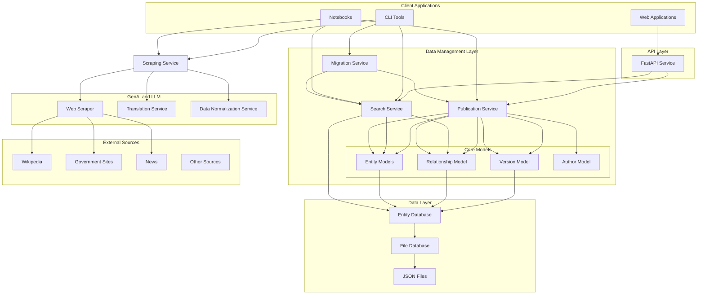

# Design Document

## Overview

The Nepal Entity Service is a comprehensive system designed to manage Nepali public entities with a focus on transparency, accountability, and data integrity. The system provides a robust foundation for civic technology applications by offering structured entity management, versioning, relationship tracking, and automated data collection capabilities.

The architecture follows a service-oriented design with optional components, allowing users to install only the functionality they need. The core system provides entity models and utilities, while optional packages add API services and scraping capabilities.

## Architecture

### High-Level Architecture



### Component Architecture

The system is organized into several key components:

1. **Core Models**: Pydantic-based data models for entities, relationships, and versions
2. **Data Management Layer**: Publication, Search, and Migration services using core models
   - **Publication Service**: Entity lifecycle management using Entity, Relationship, Version, and Author models
   - **Search Service**: Entity and relationship search with filtering and pagination
   - **Migration Service**: Database update orchestration through versioned migration scripts
3. **Scraping Service**: External data extraction with GenAI/LLM components
   - **Web Scraper**: Multi-source data extraction
   - **Translation Service**: Nepali/English translation
   - **Data Normalization Service**: LLM-powered data structuring
4. **Database Layer**: Abstract database interface with file-based implementation  
5. **API Layer**: FastAPI-based REST service for data retrieval with hosted documentation
6. **Client Applications**: Web apps, CLI tools, and Jupyter notebooks with direct service access
7. **Data Maintainer Interface**: Pythonic interface for local data maintenance through services

## Components and Interfaces

### Publication Service

The **Publication Service** is the central orchestration layer that manages the complete lifecycle of entities, relationships, and their versions. Rather than having separate services for each concern, the Publication Service provides a unified interface using core Pydantic models.

#### Architecture Philosophy

The Publication Service follows a service-oriented pattern:
- **Single Entry Point**: All entity operations flow through the Publication Service
- **Core Models**: Entity, Relationship, Version, and Author Pydantic models define data structures
- **Coordinated Operations**: Cross-cutting concerns (validation, versioning, attribution) are handled consistently
- **Transaction Boundaries**: The service manages atomic operations across multiple model types

#### Core Responsibilities

1. **Entity Lifecycle Management**
   - Entity creation, updates, and retrieval using Entity models (Person, Organization, Location)
   - Automatic version creation on all modifications
   - Validation and constraint enforcement through Pydantic
   - Attribution tracking for all changes

2. **Relationship Management**
   - Relationship creation and modification using the Relationship model
   - Bidirectional relationship consistency
   - Temporal relationship tracking
   - Relationship versioning

3. **Version Control**
   - Automatic snapshot creation using the Version model
   - Historical state retrieval
   - Change tracking and audit trails
   - Author attribution using the Author model

4. **Cross-Cutting Concerns**
   - Unified validation across all operations
   - Consistent error handling
   - Transaction management
   - Event publishing for external integrations

#### Model Structure

The Publication Service uses core Pydantic models within the Data Management Layer:

**Entity Models** (`nes/core/models/entity.py`, `person.py`, `organization.py`, `location.py`)
- Base `Entity` class with common fields
- `Person` model for person entities
- `Organization` model (with `PoliticalParty` and `GovernmentBody` subclasses)
- `Location` model for location entities
- Name and identifier management through nested models
- Pydantic validation for data integrity
- Used by both Publication and Search services

**Relationship Model** (`nes/core/models/relationship.py`)
- `Relationship` class for entity connections
- Relationship type validation
- Temporal relationship handling (start_date, end_date)
- Bidirectional consistency through service logic
- Used by both Publication and Search services

**Version Model** (`nes/core/models/version.py`)
- `Version` class for change tracking
- Snapshot storage of entity/relationship state
- Change description and attribution
- Version number sequencing
- Used exclusively by Publication Service

**Author Model** (`nes/core/models/version.py`)
- `Author` class for change attribution
- Author metadata and identification
- Used by Publication Service for change tracking

#### Service Interface Example

```python
from nes.services import PublicationService
from nes.core.models import Entity, Relationship

# Initialize the publication service
pub_service = PublicationService(database=db)

# Entity operations (returns Entity model instance)
entity = pub_service.create_entity(
    entity_data=entity_dict,
    author_id="author:system:csv-importer",
    change_description="Initial import"
)

# Relationship operations (returns Relationship model instance)
relationship = pub_service.create_relationship(
    source_id="entity:person/ram-chandra-poudel",
    target_id="entity:organization/political_party/nepali-congress",
    relationship_type="MEMBER_OF",
    author_id="author:system:csv-importer"
)

# Version operations (returns list of Version model instances)
versions = pub_service.get_entity_versions(
    entity_id="entity:person/ram-chandra-poudel"
)

# Update operations with automatic versioning
updated_entity = pub_service.update_entity(
    entity=entity,
    author_id="author:system:csv-importer",
    change_description="Updated attributes"
)
```

### Search Service

The **Search Service** provides basic search capabilities for entities and relationships with support for filtering, attribute-based queries, and pagination.

#### Architecture Philosophy

The Search Service is designed as a simple, read-optimized service:
- **Separate from Publication Service**: Search is a distinct concern focused on data retrieval
- **Database-Backed**: Queries the database directly without complex indexing
- **Simple Filtering**: Basic type, subtype, and attribute filtering
- **Pagination Support**: Efficient result pagination for large datasets

#### Core Responsibilities

1. **Entity Search**
   - Basic text search across entity names (Nepali and English)
   - Type and subtype filtering
   - Attribute-based filtering
   - Pagination support

2. **Relationship Search**
   - Find relationships by type
   - Filter by source or target entity
   - Basic attribute filtering
   - Pagination support

#### Service Interface Example

```python
from nes.services import SearchService
from nes.database import FileDatabase

# Initialize search service
db = FileDatabase(base_path="./nes-db/v2")
search_service = SearchService(database=db)

# Basic entity search with text query
results = search_service.search_entities(
    query="poudel",
    limit=10,
    offset=0
)

# Entity search with filters
results = search_service.search_entities(
    query="ram",
    entity_type="person",
    sub_type="politician",
    limit=20,
    offset=0
)

# Attribute-based filtering
results = search_service.search_entities(
    attributes={"party": "nepali-congress"},
    entity_type="person",
    limit=10,
    offset=0
)

# Relationship search
relationships = search_service.search_relationships(
    relationship_type="MEMBER_OF",
    target_entity_id="entity:organization/political_party/nepali-congress",
    limit=10,
    offset=0
)

# Paginated results
page_1 = search_service.search_entities(query="politician", limit=20, offset=0)
page_2 = search_service.search_entities(query="politician", limit=20, offset=20)
```

#### Search Capabilities

**Text Search**
- Case-insensitive search across entity name fields
- Supports both Nepali (Devanagari) and English text
- Simple substring matching

**Filter Options**
- Entity type filtering (person, organization, location)
- Subtype filtering (politician, political_party, etc.)
- Attribute key-value filtering
- Identifier scheme filtering

**Pagination**
- Limit: Maximum number of results to return
- Offset: Number of results to skip
- Total count: Total matching results for pagination UI

### Migration Service

The **Migration Service** orchestrates database updates through versioned migration scripts, enabling transparent, reproducible, and community-driven data maintenance.

#### Architecture Philosophy

The Migration Service follows a deterministic execution pattern:
- **Versioned Scripts**: Sequential migration folders with Python scripts
- **Idempotent Execution**: Migrations can be safely re-run without side effects
- **Git-Based Tracking**: Migration history tracked through Git commits
- **Service Orchestration**: Uses Publication and Search services for data operations

#### Core Responsibilities

1. **Migration Discovery**
   - Scan `migrations/` directory for migration folders
   - Parse migration metadata (prefix, name, description)
   - Validate migration structure (migrate.py, README.md)

2. **Execution Management**
   - Determine pending migrations by querying Git history
   - Execute migrations in sequential order
   - Provide migration context with service access
   - Track execution time and statistics

3. **Git Integration**
   - Commit changes to Database Repository after execution
   - Create structured commit messages with metadata
   - Push commits to remote repository
   - Update submodule references

4. **Migration Context**
   - Provide access to Publication Service for data writes
   - Provide access to Search Service for data queries
   - Provide access to Scraping Service for data extraction
   - Provide file reading helpers (CSV, JSON, Excel)
   - Provide logging mechanism

#### Service Interface Example

```python
from nes.services.migration import MigrationService, MigrationManager

# Initialize migration service
migration_service = MigrationService(
    migrations_dir="migrations",
    db_repo_path="nes-db"
)

# List all migrations
migrations = await migration_service.list_migrations()
for migration in migrations:
    print(f"{migration.prefix:03d}-{migration.name}")

# Get pending migrations
pending = await migration_service.get_pending_migrations()
print(f"Pending: {len(pending)} migrations")

# Execute specific migration
result = await migration_service.run_migration(
    migration_name="005-add-ministers",
    dry_run=False
)
print(f"Status: {result.status}")
print(f"Entities created: {result.entities_created}")

# Execute all pending migrations
results = await migration_service.run_all_pending()
for result in results:
    print(f"{result.migration_name}: {result.status}")
```

#### Migration Script Structure

Each migration script has access to a context object:

```python
# migrations/005-add-ministers/migrate.py
"""
Migration: 005-add-ministers
Description: Import current cabinet ministers
Author: contributor@example.com
Date: 2024-03-15
"""

AUTHOR = "contributor@example.com"
DATE = "2024-03-15"
DESCRIPTION = "Import current cabinet ministers from official records"

async def migrate(context):
    """
    Main migration function.
    
    Args:
        context: MigrationContext with service access
    """
    # Read data files
    ministers = context.read_csv("ministers.csv")
    
    # Use Publication Service
    for row in ministers:
        entity = await context.publication.create_entity(
            entity_data={
                "slug": row["slug"],
                "type": "person",
                "sub_type": "politician",
                "names": [{"kind": "PRIMARY", "en": {"full": row["name"]}}]
            },
            author_id="author:migration:005-add-ministers",
            change_description="Import minister"
        )
        
        # Use Search Service to find related entities
        party = await context.search.find_entity_by_name(
            name=row["party"],
            entity_type="organization"
        )
        
        # Create relationships
        if party:
            await context.publication.create_relationship(
                source_entity_id=entity.id,
                target_entity_id=party.id,
                relationship_type="MEMBER_OF",
                author_id="author:migration:005-add-ministers",
                change_description="Add party membership"
            )
    
    context.log(f"Imported {len(ministers)} ministers")
```

#### Migration Workflow

1. **Contributor creates migration** in `migrations/NNN-name/` folder
2. **Contributor submits PR** with migration code (no database changes)
3. **GitHub Actions run tests** on migration code
4. **Maintainer reviews and merges** PR to main branch
5. **GitHub Actions auto-execute** migration on merge
6. **Migration Service runs** the migration script
7. **Changes committed** to Database Repository with metadata
8. **Submodule updated** in Service API Repository

#### Determinism Through Git

The Migration Service uses Git commits as the tracking mechanism:
- Each migration execution creates a commit in the Database Repository
- Commit message includes migration name and metadata
- Re-running migrations checks Git log for existing commits
- If commit exists, migration is skipped (already applied)
- This ensures idempotent execution without a separate tracking database

### Core Models

#### Entity Model
The `Entity` model serves as the foundation for all entity types:

- **Identification**: Unique slug-based IDs with computed full identifiers
- **Typing**: Hierarchical type system (type + subtype)
- **Naming**: Multilingual name support with primary/alias classifications
- **Metadata**: Versioning, timestamps, attributions, and external identifiers
- **Extensibility**: Flexible attributes system for domain-specific data

#### Relationship Model
The `Relationship` model manages connections between entities:

- **Bidirectional**: Source and target entity references
- **Typed**: Predefined relationship types (AFFILIATED_WITH, MEMBER_OF, etc.)
- **Temporal**: Optional start and end dates for time-bound relationships
- **Attributed**: Custom attributes for relationship-specific metadata

#### Version Model
The `Version` model provides comprehensive audit trails:

- **Snapshots**: Complete entity/relationship state preservation
- **Attribution**: Author tracking for all modifications
- **Timestamps**: Creation and modification tracking
- **Metadata**: Change descriptions and source information

### Database Interface

#### EntityDatabase Abstract Class
Provides standardized CRUD operations for:

- **Entities**: Create, read, update, delete, and list operations
- **Relationships**: Full relationship lifecycle management
- **Versions**: Version creation, retrieval, and listing
- **Authors**: Author management for attribution tracking

#### File Database Implementation
File-based storage system with:

- **JSON Storage**: Human-readable entity files
- **Directory Structure**: Organized by entity type and subtype at `nes-db/v2`
- **Atomic Operations**: Safe concurrent access patterns
- **Backup Support**: Version history preservation
- **Database Location**: All entity data stored in `nes-db/v2` directory

#### Data Maintainer Interface
Pythonic interface for local data maintenance operations:

- **Local Python Access**: Direct Python API for maintainers to use in local scripts and notebooks
- **No Authentication Required**: Designed for trusted local environment use without authentication overhead
- **Entity Updates**: Simplified entity modification with automatic versioning
- **Relationship Management**: Easy relationship creation, modification, and deletion
- **Schema Validation**: Real-time data validation feedback during write operations
- **Batch Operations**: Bulk update capabilities for large-scale data maintenance
- **Change Tracking**: Automatic attribution and change description capture

### API Service

#### REST Endpoints

All API endpoints are served under the `/api` prefix, with documentation served at the root:

**API Endpoints (`/api/*`)**
- **Entity Retrieval**: `/api/entities` - Read operations with filtering and pagination
- **Entity Details**: `/api/entities/{entity_id}` - Get specific entity by ID
- **Version Access**: `/api/entities/{entity_id}/versions` - Historical entity state retrieval
- **Relationship Queries**: `/api/relationships` - Entity connection exploration
- **Search Endpoints**: `/api/search` - Basic text and filtered search via Search Service
- **Health Check**: `/api/health` - System health and readiness status

**Documentation Endpoints**
- **Root**: `/` - Main documentation landing page
- **Documentation Pages**: `/{page}` - Individual documentation pages from Markdown
- **API Schema**: `/docs` - OpenAPI/Swagger schema documentation

Note: Write operations are handled through the Publication Service in notebooks and scripts, not through the API.

#### Documentation Hosting

The API service hosts comprehensive documentation from the root endpoint, providing a unified documentation experience:

**Root Documentation Portal (`/`)**
- **Endpoint**: `/` serves the main documentation landing page
- **Format**: Static HTML generated from Markdown files
- **Content**: Architecture overview, usage guides, API reference, examples
- **Navigation**: Simple navigation between documentation sections
- **Public Access**: No authentication required, fully public documentation

**API Schema Documentation (`/docs`)**
- **Endpoint**: `/docs` provides OpenAPI/Swagger schema documentation
- **Auto-generated**: FastAPI automatically generates OpenAPI 3.0 specification
- **Schema Exploration**: Complete data model documentation with request/response examples
- **Read-Only**: Documentation for read-only public API endpoints

**Documentation Structure**
```
docs/
├── index.md              # Landing page (served at /)
├── getting-started.md    # Quick start guide
├── architecture.md       # System architecture
├── api-reference.md      # API endpoint documentation
├── data-models.md        # Entity, Relationship, Version schemas
├── examples.md           # Usage examples
└── contributing.md       # Contribution guidelines
```

**Documentation Build and Serving**
```python
from fastapi import FastAPI
from fastapi.staticfiles import StaticFiles
from fastapi.responses import FileResponse
import markdown

app = FastAPI()

# Serve API endpoints under /api prefix
app.include_router(api_router, prefix="/api")

# Serve OpenAPI docs at /docs
# (FastAPI default, no configuration needed)

# Serve markdown documentation at root
@app.get("/")
async def root():
    """Serve the main documentation landing page."""
    with open("docs/index.md", "r") as f:
        content = markdown.markdown(f.read())
    return HTMLResponse(content=render_template(content))

# Serve other documentation pages
@app.get("/{page}")
async def documentation_page(page: str):
    """Serve documentation pages from markdown files."""
    try:
        with open(f"docs/{page}.md", "r") as f:
            content = markdown.markdown(f.read())
        return HTMLResponse(content=render_template(content))
    except FileNotFoundError:
        raise HTTPException(status_code=404, detail="Page not found")
```

**Documentation Features**
- **Markdown-Based**: All documentation written in simple Markdown files
- **Version Control**: Documentation versioned alongside code in Git
- **Easy Updates**: Non-technical contributors can update documentation via Markdown
- **No Build Step**: Markdown rendered on-the-fly by the API service
- **Consistent Styling**: Simple HTML template for consistent look and feel

#### Middleware Stack
- **CORS Support**: Cross-origin request handling for web applications
- **Error Handling**: Standardized error responses with detailed messages
- **Request Validation**: Automatic validation of input params using Pydantic
- **Response Formatting**: Consistent JSON response structure

### Scraping Service

The **Scraping Service** is a standalone service responsible for extracting and normalizing data from external sources using GenAI and LLM capabilities. It does not directly access the database but returns normalized data for client applications to process.

#### Architecture Philosophy

The Scraping Service is designed as a data extraction and transformation layer:
- **Source Agnostic**: Pluggable extractors for different data sources
- **No Database Access**: Returns normalized data without persisting it
- **GenAI/LLM Integration**: Uses language models for intelligent data extraction and normalization
- **Reusable**: Can be used by CLI, notebooks, and import scripts

**Note**: While the Scraping Service does not directly access entities in the database, it may accept structured or unstructured inputs from users or existing entities (e.g., entity IDs, names, or attributes) to guide data extraction and normalization. The service produces normalized data that can be reviewed and imported by client applications.

#### Core Components

**Web Scraper**
- Multi-source data extraction (Wikipedia, government sites, news)
- Rate limiting and respectful scraping
- Error handling and retry logic
- HTML parsing and content extraction

**Translation Service**
- Nepali to English translation
- English to Nepali translation
- Transliteration handling
- Language detection

**Data Normalization Service**
- LLM-powered data structuring
- Extract structured data from unstructured text
- Relationship discovery from narrative text
- Name disambiguation and standardization
- Data quality assessment

#### Supported Data Sources

- **Wikipedia**: Politician profiles, organization pages, infoboxes
- **Government Sites**: Election Commission data, ministry registrations
- **News**: Public statements, event coverage, biographical information
- **Other Sources**: Social media, official announcements

#### Service Interface Example

```python
from nes.services import ScrapingService

# Initialize scraping service
scraping_service = ScrapingService()

# Extract entity data from Wikipedia
raw_data = scraping_service.extract_from_wikipedia(
    page_title="Ram_Chandra_Poudel",
    language="en"
)

# Normalize to entity model (doesn't save to database)
normalized_entity = scraping_service.normalize_person_data(
    raw_data=raw_data,
    source="wikipedia"
)

# Extract relationships from text using LLM
relationships = scraping_service.extract_relationships(
    text="Ram Chandra Poudel is a member of Nepali Congress",
    entity_id="entity:person/ram-chandra-poudel"
)

# Translate Nepali text to English
translated = scraping_service.translate(
    text="राम चन्द्र पौडेल",
    source_lang="ne",
    target_lang="en"
)
```

### CLI Tools

The CLI provides command-line access to the system, using Search Service for database queries and Scraping Service for external data discovery. The CLI is built using Python Click, a composable command-line interface toolkit that provides elegant argument parsing, help generation, and command grouping.

#### CLI Capabilities

- **Entity Search**: Search and filter entities from the database
- **Entity Display**: View detailed entity information
- **Relationship Exploration**: Browse entity relationships
- **External Search**: Search external sources using Scraping Service
- **Data Export**: Export search results to various formats

#### CLI Integration Example

```python
from nes.services import SearchService, ScrapingService
from nes.database import FileDatabase

# CLI command: nes search "ram poudel"
def cli_search(query: str, entity_type: str = None):
    db = FileDatabase(base_path="./nes-db/v2")
    search_service = SearchService(database=db)
    
    results = search_service.search_entities(
        query=query,
        entity_type=entity_type,
        limit=10,
        offset=0
    )
    
    for entity in results.results:
        print(f"{entity.id}: {entity.names[0].en.full}")
    
    print(f"\nTotal results: {results.total}")

# CLI command: nes scrape-info "ram poudel"
def cli_scrape_info(query: str):
    scraping_service = ScrapingService()
    
    # Search external sources
    results = scraping_service.search_external_sources(
        query=query,
        sources=["wikipedia"]
    )
    
    for result in results:
        print(f"Source: {result.source}")
        print(f"Title: {result.title}")
        print(f"URL: {result.url}")
        print(f"Summary: {result.summary}\n")
```

### Notebook Applications

Jupyter notebooks serve as interactive data import and maintenance tools, orchestrating Publication, Search, and Scraping services.

#### Architecture Philosophy

- **Interactive Exploration**: Exploratory data import and analysis
- **Service Orchestration**: Combine Scraping, Search, and Publication services
- **Human-in-the-Loop**: Manual review and approval of scraped data
- **Iterative Development**: Test and refine data import workflows

#### Typical Notebook Workflow

```python
from nes.services import PublicationService, SearchService, ScrapingService
from nes.database import FileDatabase

# Initialize all services
db = FileDatabase(base_path="./nes-db/v2")
pub_service = PublicationService(database=db)
search_service = SearchService(database=db)
scraping_service = ScrapingService()

# Notebook workflow: Import politician from Wikipedia
def import_politician_from_wikipedia(wikipedia_page: str):
    # 1. Scrape data from Wikipedia using Scraping Service
    raw_data = scraping_service.extract_from_wikipedia(
        page_title=wikipedia_page,
        language="en"
    )
    
    # 2. Normalize to entity model
    normalized = scraping_service.normalize_person_data(
        raw_data=raw_data,
        source="wikipedia"
    )
    
    # 3. Check for duplicates using Search Service
    existing = search_service.search_entities(
        query=normalized["names"][0]["en"]["full"],
        entity_type="person",
        sub_type="politician",
        limit=5
    )
    
    # 4. Review and decide (human-in-the-loop)
    if existing.total > 0:
        print(f"Found {existing.total} potential duplicates:")
        for e in existing.results:
            print(f"  - {e.id}: {e.names[0].en.full}")
        
        # Manual decision: update or create new
        should_update = input("Update existing? (y/n): ")
        
        if should_update.lower() == 'y':
            entity_id = input("Enter entity ID to update: ")
            entity = pub_service.get_entity(entity_id)
            # Merge and update
            pub_service.update_entity(
                entity=entity,
                author_id="author:human:data-maintainer",
                change_description=f"Updated from Wikipedia: {wikipedia_page}"
            )
        else:
            # Create new entity
            entity = pub_service.create_entity(
                entity_data=normalized,
                author_id="author:human:data-maintainer",
                change_description=f"Imported from Wikipedia: {wikipedia_page}"
            )
    else:
        # No duplicates, create new
        entity = pub_service.create_entity(
            entity_data=normalized,
            author_id="author:human:data-maintainer",
            change_description=f"Imported from Wikipedia: {wikipedia_page}"
        )
    
    return entity

# Use in notebook
politician = import_politician_from_wikipedia("Ram_Chandra_Poudel")
print(f"Imported: {politician.id}")
```

#### Notebook Use Cases

- **Interactive Data Import**: Import entities with manual review
- **Data Quality Analysis**: Analyze and fix data quality issues
- **Experimental Workflows**: Test new scraping and normalization approaches
- **Bulk Operations**: Process multiple entities with human oversight
- **Data Exploration**: Explore relationships and entity connections

## Data Models

### Entity Schema

```json
{
  "slug": "string (required, 3-50 chars, kebab-case)",
  "type": "person|organization|location",
  "sub_type": "political_party|government_body|province|district|...",
  "names": [
    {
      "kind": "PRIMARY|ALIAS|ALTERNATE|BIRTH|OFFICIAL",
      "en": {
        "full": "string",
        "given": "string?",
        "middle": "string?",
        "family": "string?",
        "prefix": "string?",
        "suffix": "string?"
      },
      "ne": { /* same structure */ }
    }
  ],
  "version_summary": {
    "version": "integer",
    "created_at": "datetime",
    "created_by": "string"
  },
  "identifiers": [
    {
      "scheme": "wikipedia|wikidata|twitter|...",
      "value": "string",
      "url": "string?"
    }
  ],
  "attributes": { /* flexible key-value pairs */ },
  "contacts": [
    {
      "type": "EMAIL|PHONE|URL|...",
      "value": "string"
    }
  ],
  "descriptions": {
    "en": { "value": "string", "provenance": "human|llm|..." },
    "ne": { "value": "string", "provenance": "human|llm|..." }
  }
}
```

### Relationship Schema

```json
{
  "source_entity_id": "entity:type/subtype/slug",
  "target_entity_id": "entity:type/subtype/slug",
  "type": "AFFILIATED_WITH|EMPLOYED_BY|MEMBER_OF|...",
  "start_date": "date?",
  "end_date": "date?",
  "attributes": { /* relationship-specific data */ },
  "version_summary": { /* version metadata */ },
  "attributions": ["source1", "source2"]
}
```

### Version Schema

```json
{
  "entity_id": "string",
  "version": "integer",
  "snapshot": { /* complete entity/relationship state */ },
  "created_at": "datetime",
  "created_by": "string",
  "change_description": "string?",
  "attribution": { /* source information */ }
}
```

### Data Maintainer Interface

The Data Maintainer Interface is a Pythonic API designed for local use by trusted maintainers. It provides a clean, intuitive interface for data maintenance operations without requiring authentication.

#### Python API Example

```python
from nes.services import PublicationService
from nes.database import FileDatabase
from nes.core.models import Entity, Relationship

# Initialize database and publication service
db = FileDatabase(base_path="./nes-db/v2")
pub_service = PublicationService(database=db)

# Update an entity (automatically creates version)
entity = pub_service.get_entity("entity:person/ram-chandra-poudel")
entity.names[0].en.full = "Ram Chandra Poudel"
pub_service.update_entity(
    entity=entity,
    author_id="author:system:csv-importer",
    change_description="Updated name spelling"
)

# Create a relationship (automatically creates version)
relationship = pub_service.create_relationship(
    source_entity_id="entity:person/ram-chandra-poudel",
    target_entity_id="entity:organization/political_party/nepali-congress",
    relationship_type="MEMBER_OF",
    start_date="2000-01-01",
    author_id="author:system:csv-importer"
)

# Batch operations through publication service
entities = pub_service.list_entities(entity_type="person", sub_type="politician")
for entity in entities:
    # Process and update entities with automatic versioning
    pub_service.update_entity(
        entity, 
        author_id="author:system:batch-processor",
        change_description="Batch update"
    )

# Get version history
versions = pub_service.get_entity_versions(
    entity_id="entity:person/ram-chandra-poudel"
)
```

#### Interface Characteristics

- **No Authentication**: Operates directly on local file system without authentication checks
- **Publication Service Layer**: Uses PublicationService for coordinated operations across model types
- **Automatic Versioning**: All updates automatically create version snapshots using the Version model
- **Author Attribution**: Requires author_id for change tracking but no user authentication
- **Validation**: Full Pydantic validation on all operations coordinated by Publication Service
- **Transaction Safety**: Atomic operations managed by Publication Service
- **Model Coordination**: Entity, Relationship, and Version models work together seamlessly through the service

## Error Handling

### Validation Errors
- **Schema Validation**: Pydantic model validation with field-level error details
- **Business Rules**: Custom validation for entity-specific constraints
- **Reference Integrity**: Entity ID validation and relationship consistency checks
- **Data Quality**: Name requirements, identifier format validation

### API Error Responses
- **400 Bad Request**: Invalid input data with detailed field errors
- **404 Not Found**: Entity, relationship, or version not found
- **409 Conflict**: Duplicate entity creation attempts
- **422 Unprocessable Entity**: Valid JSON but invalid business logic
- **500 Internal Server Error**: Database or system errors

### Error Response Format

```json
{
  "error": {
    "code": "VALIDATION_ERROR",
    "message": "Entity validation failed",
    "details": [
      {
        "field": "names",
        "message": "At least one name with kind='PRIMARY' is required"
      }
    ]
  }
}
```

## Testing Strategy

### Test-Driven Development (TDD)
The project follows the Red-Green-Refactor cycle:

- **Red Phase**: Write failing tests first that define the expected behavior
- **Green Phase**: Write minimal code to make tests pass, focusing on functionality over elegance
- **Refactor Phase**: Improve code quality, performance, and maintainability while keeping tests green

### Unit Testing
- **Model Validation**: Comprehensive Pydantic model testing with TDD approach
- **Business Logic**: Core service method testing with test-first development
- **Identifier Generation**: ID building and validation testing using Red-Green-Refactor
- **Data Transformation**: Scraping and normalization testing with failing tests written first

### Integration Testing
- **Database Operations**: Full CRUD operation testing following TDD principles
- **API Endpoints**: Request/response cycle testing with test-first approach
- **Version Management**: End-to-end versioning workflow testing using Red-Green-Refactor
- **Relationship Management**: Complex relationship scenario testing with comprehensive test coverage

### End-to-End Testing
- **Complete Workflows**: Entity creation through API consumption with behavior-driven tests
- **Data Import**: Scraping to database to API testing following TDD methodology
- **Multi-Entity Scenarios**: Complex entity relationship testing with test-first design
- **Performance Testing**: Large dataset handling validation with performance benchmarks

### Test Data Strategy
- **Authentic Nepali Data**: Real Nepali names, organizations, and locations for realistic testing
- **Cultural Context**: Proper Nepali political and administrative structures in test scenarios
- **Multilingual Testing**: Nepali and English name variations with comprehensive coverage
- **Edge Cases**: Boundary conditions and error scenarios designed through failing tests first

### TDD Implementation Guidelines
- **Test First**: Always write tests before implementing functionality
- **Minimal Implementation**: Write just enough code to pass the current test
- **Continuous Refactoring**: Regularly improve code structure while maintaining test coverage
- **Fast Feedback**: Ensure tests run quickly to support rapid Red-Green-Refactor cycles

## Performance Considerations

### Read-Time Optimization Priority
The system prioritizes read-time latency reduction over write-time performance, as the read-only API serves public consumers while writes are performed by data maintainers in controlled environments.

### Database Optimization
- **Read-Optimized File Organization**: Directory structure designed for fast entity lookups and retrieval
- **Aggressive Caching Strategy**: In-memory caching for frequently accessed entities with cache warming
- **Pre-computed Indexes**: Build search indexes during write operations to accelerate read queries
- **Denormalized Storage**: Store redundant data to minimize read-time joins and computations
- **Write-Time Processing**: Perform expensive operations (validation, normalization, indexing) during writes

### Search Service Optimization
- **Database Query Optimization**: Efficient filtering at the database layer
- **Result Caching**: Cache common search queries
- **Pagination Efficiency**: Limit result set sizes for fast response times

### API Performance
- **Fast Response Times**: Optimize for sub-100ms response times for entity retrieval
- **Efficient Pagination**: Pre-sorted data structures for instant offset-based pagination
- **HTTP Caching**: Aggressive caching headers with ETags for unchanged data
- **Query Pre-processing**: Pre-compute common filter combinations during write operations
- **Connection Pooling**: Optimize database connections for concurrent read requests

### Write-Time Trade-offs
- **Comprehensive Validation**: Accept longer write times for thorough data validation
- **Index Rebuilding**: Rebuild search indexes during writes to maintain read performance
- **Batch Processing**: Group write operations to amortize expensive operations
- **Background Processing**: Defer non-critical write operations to background tasks

### Scalability Design
- **Read Replica Strategy**: Support for multiple read-only database replicas
- **CDN Integration**: Static asset delivery through content delivery networks
- **Horizontal Read Scaling**: Independent scaling of read-only API instances
- **Async Write Processing**: Non-blocking write operations with eventual consistency

## Security Considerations

### Data Protection
- **Input Validation**: Comprehensive sanitization of all inputs
- **SQL Injection Prevention**: Parameterized queries and safe operations
- **XSS Protection**: Proper output encoding and sanitization
- **File System Security**: Safe file operations and path validation

### API Security
- **CORS Configuration**: Controlled cross-origin access
- **Rate Limiting**: Protection against DoS attacks
- **Input Size Limits**: Prevention of resource exhaustion
- **Error Information**: Careful error message disclosure

### Data Privacy
- **PII Handling**: Careful management of personally identifiable information
- **Attribution Privacy**: Optional anonymous contributions
- **Data Retention**: Clear policies for data lifecycle management
- **Access Control**: Future authentication and authorization framework


## Migration System

### Overview

The Open Database Updates feature introduces a migration-based system for managing data evolution in the Nepal Entity Service. This system enables community contributions through versioned migration folders that contain executable Python scripts and supporting data files. The design follows database migration patterns (similar to Flyway, Alembic, or Django migrations) but applies them to data changes rather than schema changes.

### Two-Repository Architecture

The system operates across two GitHub repositories:

1. **Service API Repository** (https://github.com/NewNepal-org/NepalEntityService)
   - Contains application code (Python packages, API, CLI)
   - Contains migration scripts in `migrations/` directory
   - Lightweight repository (~10MB)
   - Contributors submit PRs here with new migrations
   - Maintainers review and merge migration PRs here

2. **Database Repository** (https://github.com/NewNepal-org/NepalEntityService-database)
   - Contains actual entity/relationship JSON files (100k-1M files)
   - Managed as Git submodule at `nes-db/` in Service API Repository
   - Large repository (~1GB+)
   - Modified by migration execution (not by direct PRs)
   - Tracks migration history through Git commits

**Workflow**:
1. Contributor creates migration folder in Service API Repository
2. Contributor submits PR to Service API Repository
3. Maintainer reviews migration code and merges PR
4. Maintainer executes migration locally using `nes migrate run`
5. Migration modifies files in Database Repository (nes-db/ submodule)
6. Migration system commits changes to Database Repository with metadata
7. Migration system pushes commits to Database Repository remote
8. Migration system updates submodule reference in Service API Repository

**Design Rationale**:
- **Separation of Concerns**: Application code and data are managed independently
- **Performance**: Service API repo remains lightweight for fast clones
- **Scalability**: Database repo can grow to millions of files without affecting service development
- **Review Process**: Migration code is reviewed separately from data changes
- **Audit Trail**: Git history in Database repo provides complete data evolution history
- **Flexibility**: Database repo can use different Git strategies (shallow clones, sparse checkout) without affecting service repo

### Migration Components

#### 1. Migration Manager

**Responsibility**: Discover and validate migrations.

**Key Methods**:
```python
class MigrationManager:
    def __init__(self, migrations_dir: Path, db_repo_path: Path):
        """Initialize with migrations directory and database repo path."""
        
    async def discover_migrations(self) -> List[Migration]:
        """Scan migrations directory and return sorted list of migrations."""
        
    async def get_applied_migrations(self) -> List[str]:
        """Get list of applied migration names by checking persisted snapshots."""
        
    async def get_pending_migrations(self) -> List[Migration]:
        """Get migrations that haven't been applied yet."""
        
    async def is_migration_applied(self, migration: Migration) -> bool:
        """Check if a specific migration has been applied."""
        
    async def validate_migration(self, migration: Migration) -> ValidationResult:
        """Validate migration structure and script syntax."""
```

#### 2. Migration Runner

**Responsibility**: Execute migration scripts and manage Git operations.

**Key Methods**:
```python
class MigrationRunner:
    def __init__(
        self, 
        publication_service: PublicationService,
        search_service: SearchService,
        scraping_service: ScrapingService,
        db: EntityDatabase,
        db_repo_path: Path
    ):
        """Initialize with services and database repo path."""
        
    async def run_migration(
        self, 
        migration: Migration,
        dry_run: bool = False,
        auto_commit: bool = True,
        force: bool = False
    ) -> MigrationResult:
        """
        Execute a migration script and optionally commit changes.
        
        Args:
            migration: Migration to execute
            dry_run: If True, don't commit changes
            auto_commit: If True, commit and push changes after execution
            force: If True, allow re-execution of already-applied migrations
        
        Returns:
            MigrationResult with execution details
            
        Raises:
            MigrationAlreadyAppliedException: If migration was already applied and force=False
        """
        
    async def run_migrations(
        self,
        migrations: List[Migration],
        dry_run: bool = False,
        auto_commit: bool = True
    ) -> List[MigrationResult]:
        """Execute multiple migrations in order, skipping already-applied ones."""
        
    def create_context(self, migration: Migration) -> MigrationContext:
        """Create execution context for migration script."""
        
    async def commit_and_push(
        self,
        migration: Migration,
        result: MigrationResult
    ) -> None:
        """
        Commit database changes and push to remote.
        
        This persists the data snapshot in the Database Repository,
        making the migration deterministic on subsequent runs.
        """
```

#### 3. Migration Context

**Responsibility**: Provide minimal context and utilities for migration scripts.

**Key Methods**:
```python
class MigrationContext:
    """Thin context object passed to migration scripts."""
    
    def __init__(
        self,
        publication_service: PublicationService,
        search_service: SearchService,
        scraping_service: ScrapingService,
        db: EntityDatabase,
        migration_dir: Path
    ):
        """Initialize with services and migration directory."""
        self.publication = publication_service
        self.search = search_service
        self.scraping = scraping_service
        self.db = db
        self._migration_dir = migration_dir
        self._logs = []
    
    @property
    def migration_dir(self) -> Path:
        """Path to the migration folder."""
        return self._migration_dir
    
    # File reading helpers
    def read_csv(self, filename: str) -> List[Dict[str, Any]]:
        """Read CSV file from migration folder."""
        
    def read_json(self, filename: str) -> Any:
        """Read JSON file from migration folder."""
        
    def read_excel(
        self,
        filename: str,
        sheet_name: str = None
    ) -> List[Dict[str, Any]]:
        """Read Excel file from migration folder."""
    
    # Logging
    def log(self, message: str) -> None:
        """Log a message during migration execution."""
```

**Migration Script Usage**:
```python
async def migrate(context):
    """Migration scripts use services directly."""
    # Read data
    ministers = context.read_csv("ministers.csv")
    
    # Use publication service directly
    author_id = "author:migration:005-add-ministers"
    
    for row in ministers:
        entity = Entity(...)
        
        # Direct service call (no wrapper)
        await context.publication.create_entity(
            entity=entity,
            author_id=author_id,
            change_description="Import minister"
        )
    
    # Use search service directly
    existing = await context.search.find_entity_by_name("Ram Sharma")
    
    # Use scraping service directly
    normalized = await context.scraping.normalize_name("राम शर्मा")
    
    context.log(f"Imported {len(ministers)} ministers")
```

### Migration Models

```python
@dataclass
class Migration:
    """Represents a migration folder."""
    prefix: int  # Numeric prefix (000, 001, etc.)
    name: str  # Descriptive name
    folder_path: Path  # Full path to migration folder
    script_path: Path  # Path to migrate.py or run.py
    readme_path: Optional[Path]  # Path to README.md if exists
    author: Optional[str]  # Author from migration metadata
    date: Optional[datetime]  # Date from migration metadata
    
    @property
    def full_name(self) -> str:
        """Returns formatted name like '000-initial-locations'."""
        return f"{self.prefix:03d}-{self.name}"
    
@dataclass
class MigrationResult:
    """Result of migration execution."""
    migration: Migration
    status: MigrationStatus
    duration_seconds: float
    entities_created: int
    entities_updated: int
    relationships_created: int
    error: Optional[Exception]
    logs: List[str]
    git_commit_sha: Optional[str]  # SHA of commit in database repo

class MigrationStatus(str, Enum):
    """Status of a migration."""
    RUNNING = "running"
    COMPLETED = "completed"
    FAILED = "failed"
    SKIPPED = "skipped"
```

### Migration Folder Structure

**Standard Structure**:
```
migrations/
├── 000-initial-locations/
│   ├── migrate.py          # Main migration script (required)
│   ├── README.md           # Documentation (required)
│   ├── locations.csv       # Data file (optional)
│   └── sources.txt         # Source references (optional)
├── 001-political-parties/
│   ├── migrate.py
│   ├── README.md
│   ├── parties.json
│   └── logos/              # Subdirectory for assets (optional)
│       ├── party1.png
│       └── party2.png
└── 002-update-names/
    ├── migrate.py
    ├── README.md
    └── corrections.xlsx
```

### Migration History via Git

Instead of maintaining a separate migration history table, we rely on Git history in the Database Repository:

**Git Commit Message Format**:
```
Migration: 000-initial-locations

Imported initial location data for Nepal's administrative divisions.

Author: contributor@example.com
Date: 2024-01-20
Entities created: 753
Relationships created: 0
Duration: 45.2s
```

**Determining Applied Migrations**:

The Migration Manager determines which migrations have been applied by checking persisted snapshots in the Database Repository:

```python
async def get_applied_migrations(self) -> List[str]:
    """
    Get list of applied migration names by checking persisted snapshots.
    
    This queries the Database Repository's Git log to find all commits
    that represent persisted data snapshots from applied migrations.
    """
    # Query git log in database repo for migration commits
    result = subprocess.run(
        ["git", "log", "--grep=^Migration:", "--format=%s"],
        cwd=self.db_repo_path,
        capture_output=True,
        text=True
    )
    
    # Parse migration names from commit messages
    applied = []
    for line in result.stdout.split('\n'):
        if line.startswith('Migration: '):
            migration_name = line.replace('Migration: ', '').strip()
            if ' (Batch ' in migration_name:
                migration_name = migration_name.split(' (Batch ')[0]
            if migration_name not in applied:
                applied.append(migration_name)
    
    return applied
```

### Linear Migration Model

**Design Principle**: Migrations are applied in strict sequential order with no forking or merging.

**Characteristics**:

1. **Numeric Prefixes**: Migrations numbered sequentially (000, 001, 002, ...)
2. **Single Branch**: All migrations applied to main branch only
3. **No Parallel Execution**: One migration at a time
4. **No Rollback**: Migrations are forward-only; corrections done via new migrations
5. **Deterministic Order**: Same sequence on all environments

**Migration Sequence**:
```
000-initial-locations  →  001-political-parties  →  002-update-names  →  003-add-ministers
     (applied)                 (applied)                (applied)            (pending)
```

### Migration Determinism and Idempotency

**Problem**: Migration scripts may contain non-deterministic operations (e.g., GenAI calls, timestamps, random IDs). Running the same migration twice could create duplicate entities or inconsistent data.

**Solution**: The Migration System ensures determinism by persisting the data snapshot after each migration execution and preventing re-execution:

```python
async def run_migration(
    self,
    migration: Migration,
    dry_run: bool = False,
    auto_commit: bool = True,
    force: bool = False
) -> MigrationResult:
    """Execute migration with determinism guarantee."""
    
    # Check if migration already applied
    if not force and await self.is_migration_applied(migration):
        return MigrationResult(
            migration=migration,
            status=MigrationStatus.SKIPPED,
            message="Migration already applied"
        )
    
    # Execute migration
    result = await self._execute_migration(migration)
    
    # Persist data snapshot (commit to Database Repository)
    if not dry_run and auto_commit and result.status == MigrationStatus.COMPLETED:
        await self.commit_and_push(migration, result)
        # Now migration is marked as applied in Git history
    
    return result
```

**Guarantees**:

1. **Single Execution**: Each migration executes at most once (unless forced)
2. **Persisted State**: The resulting data snapshot is committed to Git
3. **Idempotent Commands**: Running `nes migrate run --all` multiple times is safe
4. **No Duplicates**: Entities created by a migration won't be duplicated on re-run
5. **Consistent Results**: The data snapshot in Git represents the canonical result

### CLI Commands

```bash
# List all migrations and their status (applied/pending)
nes migrate list

# Show migration history (applied migrations from Git log)
nes migrate history

# Show pending migrations (not yet applied)
nes migrate pending

# Validate a specific migration
nes migrate validate <migration_name>

# Run a specific migration
nes migrate run <migration_name>

# Run all pending migrations
nes migrate run --all

# Run migration in dry-run mode (no changes applied)
nes migrate run <migration_name> --dry-run

# Create a new migration folder from template
nes migrate create <descriptive-name>
```

### Batch Commits for Large Migrations

When migrations create or modify large numbers of files (e.g., 10,000+ entities), committing all changes in a single Git commit can cause performance issues. The Migration Runner implements batch commits:

```python
class MigrationRunner:
    BATCH_COMMIT_THRESHOLD = 1000  # Commit in batches if more than 1000 files changed
    BATCH_SIZE = 1000  # Files per batch commit
    
    async def commit_and_push(
        self,
        migration: Migration,
        result: MigrationResult,
        auto_commit: bool = True
    ) -> None:
        """Commit changes in batches to avoid huge commits."""
        if not auto_commit:
            return
        
        # Get list of changed files
        changed_files = self._get_changed_files()
        
        if len(changed_files) < self.BATCH_COMMIT_THRESHOLD:
            self._commit_all(migration, result, changed_files)
            self._push()
            return
        
        # Commit in batches
        for i in range(0, len(changed_files), self.BATCH_SIZE):
            batch = changed_files[i:i+self.BATCH_SIZE]
            batch_num = i // self.BATCH_SIZE + 1
            total_batches = (len(changed_files) + self.BATCH_SIZE - 1) // self.BATCH_SIZE
            
            self._commit_batch(migration, result, batch, batch_num, total_batches)
        
        # Push all commits at once
        self._push()
```

### CI/CD Integration

The migration system uses two GitHub Actions workflows:

#### 1. Migration Preview Workflow (on PR)

**Trigger**: Pull request created or updated

**Purpose**: Execute migration and generate statistics for review

**Actions**:
- Detect new migrations in PR
- Execute migrations in isolated environment
- Generate statistics (entities/relationships created)
- Post comment on PR with statistics and logs link

#### 2. Migration Persistence Workflow (on merge or schedule)

**Trigger**: 
- PR merged to main branch
- Scheduled daily at 2 AM UTC

**Purpose**: Persist approved migrations to Database Repository

**Actions**:
- Check for pending migrations
- Execute pending migrations
- Commit changes to Database Repository
- Push to remote Database Repository
- Update submodule reference in Service API Repository

### Contributor Workflow

**Step-by-Step Process**:

1. **Fork and Clone Service API Repository**
2. **Create Migration Folder** using `nes migrate create <name>`
3. **Add Data Files** (CSV, Excel, JSON) to migration folder
4. **Implement Migration Script** in `migrate.py`
5. **Document Migration** in `README.md`
6. **Test Locally** (optional) using `nes migrate validate`
7. **Submit Pull Request** to Service API Repository

**What Contributors Need**:
- Fork of Service API Repository
- Python environment with nes package installed
- Data files to import
- Basic understanding of Entity data model

**What Contributors Don't Need**:
- Access to Database Repository
- Ability to execute migrations (maintainers do this)
- Large disk space for database files
