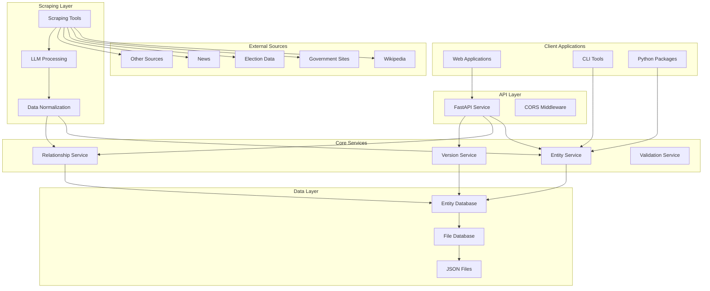

# Design Document

## Overview

The Nepal Entity Service is a comprehensive system designed to manage Nepali public entities with a focus on transparency, accountability, and data integrity. The system provides a robust foundation for civic technology applications by offering structured entity management, versioning, relationship tracking, and automated data collection capabilities.

The architecture follows a modular design with optional components, allowing users to install only the functionality they need. The core system provides entity models and utilities, while optional modules add API services and scraping capabilities.

## Architecture

### High-Level Architecture



### Component Architecture

The system is organized into several key components:

1. **Core Models**: Pydantic-based data models for entities, relationships, and versions
2. **Database Layer**: Abstract database interface with file-based implementation  
3. **Read-Only API Layer**: FastAPI-based REST service for data retrieval with CORS support
4. **Data Maintainer Interface**: Separate write interface with comprehensive validation
5. **Scraping Layer**: ML-powered data extraction and normalization tools

## Components and Interfaces

### Core Models

#### Entity Model
The `Entity` model serves as the foundation for all entity types:

- **Identification**: Unique slug-based IDs with computed full identifiers
- **Typing**: Hierarchical type system (type + subtype)
- **Naming**: Multilingual name support with primary/alias classifications
- **Metadata**: Versioning, timestamps, attributions, and external identifiers
- **Extensibility**: Flexible attributes system for domain-specific data

#### Relationship Model
The `Relationship` model manages connections between entities:

- **Bidirectional**: Source and target entity references
- **Typed**: Predefined relationship types (AFFILIATED_WITH, MEMBER_OF, etc.)
- **Temporal**: Optional start and end dates for time-bound relationships
- **Attributed**: Custom attributes for relationship-specific metadata

#### Version Model
The `Version` model provides comprehensive audit trails:

- **Snapshots**: Complete entity/relationship state preservation
- **Attribution**: Actor tracking for all modifications
- **Timestamps**: Creation and modification tracking
- **Metadata**: Change descriptions and source information

### Database Interface

#### EntityDatabase Abstract Class
Provides standardized CRUD operations for:

- **Entities**: Create, read, update, delete, and list operations
- **Relationships**: Full relationship lifecycle management
- **Versions**: Version creation, retrieval, and listing
- **Actors**: Actor management for attribution tracking

#### File Database Implementation
File-based storage system with:

- **JSON Storage**: Human-readable entity files
- **Directory Structure**: Organized by entity type and subtype
- **Atomic Operations**: Safe concurrent access patterns
- **Backup Support**: Version history preservation

#### Data Maintainer Interface
Specialized interface for data maintenance operations:

- **Entity Updates**: Simplified entity modification with automatic versioning
- **Relationship Management**: Easy relationship creation, modification, and deletion
- **Schema Validation**: Real-time data validation feedback during write operations
- **Batch Operations**: Bulk update capabilities for large-scale data maintenance
- **Change Tracking**: Automatic attribution and change description capture

### API Service

#### REST Endpoints
Comprehensive API surface including:

- **Entity Management**: CRUD operations with filtering and pagination
- **Version Access**: Historical entity state retrieval
- **Relationship Queries**: Entity connection exploration
- **Maintainer Interface**: Specialized endpoints for data maintainer operations with simplified update workflows

#### Middleware Stack
- **CORS Support**: Cross-origin request handling for web applications
- **Error Handling**: Standardized error responses with detailed messages
- **Request Validation**: Automatic validation of input params using Pydantic
- **Response Formatting**: Consistent JSON response structure

### Scraping Tools

#### Data Extraction
Multi-source data collection from:

- **Wikipedia**: Politician and organization profiles
- **Government Sites**: Official entity registrations
- **Election Data**: Candidate and party information
- **Media Sources**: News articles and public records

#### ML Processing
Intelligent data processing including:

- **Name Normalization**: Nepali/English name standardization
- **Duplicate Detection**: Entity matching across sources
- **Relationship Extraction**: Automatic relationship discovery
- **Data Validation**: Quality assessment and error detection

## Data Models

### Entity Schema

```json
{
  "slug": "string (required, 3-50 chars, kebab-case)",
  "type": "person|organization|location",
  "sub_type": "political_party|government_body|province|district|...",
  "names": [
    {
      "kind": "PRIMARY|ALIAS|ALTERNATE|BIRTH|OFFICIAL",
      "en": {
        "full": "string",
        "first": "string?",
        "middle": "string?",
        "last": "string?",
        "prefix": "string?",
        "suffix": "string?"
      },
      "ne": { /* same structure */ }
    }
  ],
  "version_summary": {
    "version": "integer",
    "created_at": "datetime",
    "created_by": "string"
  },
  "identifiers": [
    {
      "scheme": "wikipedia|wikidata|twitter|...",
      "value": "string",
      "url": "string?"
    }
  ],
  "attributes": { /* flexible key-value pairs */ },
  "contacts": [
    {
      "type": "EMAIL|PHONE|URL|...",
      "value": "string"
    }
  ],
  "descriptions": {
    "en": { "value": "string", "provenance": "human|llm|..." },
    "ne": { "value": "string", "provenance": "human|llm|..." }
  }
}
```

### Relationship Schema

```json
{
  "source_entity_id": "entity:type:subtype:slug",
  "target_entity_id": "entity:type:subtype:slug",
  "type": "AFFILIATED_WITH|EMPLOYED_BY|MEMBER_OF|...",
  "start_date": "date?",
  "end_date": "date?",
  "attributes": { /* relationship-specific data */ },
  "version_summary": { /* version metadata */ },
  "attributions": ["source1", "source2"]
}
```

### Version Schema

```json
{
  "entity_id": "string",
  "version": "integer",
  "snapshot": { /* complete entity/relationship state */ },
  "created_at": "datetime",
  "created_by": "string",
  "change_description": "string?",
  "attribution": { /* source information */ }
}
```

### Data Maintainer Interface Schema

```json
{
  "update_entity": {
    "entity": { /* complete updated entity object */ },
    "maintainer": {
      "id": "string",
      "name": "string",
      "email": "string?"
    },
    "change_description": "string",
    "metadata": {
      "diff": { /* automatically calculated differences */ },
      "version": "integer", /* auto-incremented */
      "timestamp": "datetime", /* auto-generated */
      "attribution": { /* source information */ }
    }
  },
  "update_relationship": {
    "relationship": { /* complete updated relationship object */ },
    "maintainer": {
      "id": "string", 
      "name": "string",
      "email": "string?"
    },
    "change_description": "string",
    "metadata": {
      "diff": { /* automatically calculated differences */ },
      "version": "integer", /* auto-incremented */
      "timestamp": "datetime", /* auto-generated */
      "attribution": { /* source information */ }
    }
  }
}
```

## Error Handling

### Validation Errors
- **Schema Validation**: Pydantic model validation with field-level error details
- **Business Rules**: Custom validation for entity-specific constraints
- **Reference Integrity**: Entity ID validation and relationship consistency checks
- **Data Quality**: Name requirements, identifier format validation

### API Error Responses
- **400 Bad Request**: Invalid input data with detailed field errors
- **404 Not Found**: Entity, relationship, or version not found
- **409 Conflict**: Duplicate entity creation attempts
- **422 Unprocessable Entity**: Valid JSON but invalid business logic
- **500 Internal Server Error**: Database or system errors

### Error Response Format

```json
{
  "error": {
    "code": "VALIDATION_ERROR",
    "message": "Entity validation failed",
    "details": [
      {
        "field": "names",
        "message": "At least one name with kind='PRIMARY' is required"
      }
    ]
  }
}
```

## Testing Strategy

### Test-Driven Development (TDD)
The project follows the Red-Green-Refactor cycle:

- **Red Phase**: Write failing tests first that define the expected behavior
- **Green Phase**: Write minimal code to make tests pass, focusing on functionality over elegance
- **Refactor Phase**: Improve code quality, performance, and maintainability while keeping tests green

### Unit Testing
- **Model Validation**: Comprehensive Pydantic model testing with TDD approach
- **Business Logic**: Core service method testing with test-first development
- **Identifier Generation**: ID building and validation testing using Red-Green-Refactor
- **Data Transformation**: Scraping and normalization testing with failing tests written first

### Integration Testing
- **Database Operations**: Full CRUD operation testing following TDD principles
- **API Endpoints**: Request/response cycle testing with test-first approach
- **Version Management**: End-to-end versioning workflow testing using Red-Green-Refactor
- **Relationship Management**: Complex relationship scenario testing with comprehensive test coverage

### End-to-End Testing
- **Complete Workflows**: Entity creation through API consumption with behavior-driven tests
- **Data Import**: Scraping to database to API testing following TDD methodology
- **Multi-Entity Scenarios**: Complex entity relationship testing with test-first design
- **Performance Testing**: Large dataset handling validation with performance benchmarks

### Test Data Strategy
- **Authentic Nepali Data**: Real Nepali names, organizations, and locations for realistic testing
- **Cultural Context**: Proper Nepali political and administrative structures in test scenarios
- **Multilingual Testing**: Nepali and English name variations with comprehensive coverage
- **Edge Cases**: Boundary conditions and error scenarios designed through failing tests first

### TDD Implementation Guidelines
- **Test First**: Always write tests before implementing functionality
- **Minimal Implementation**: Write just enough code to pass the current test
- **Continuous Refactoring**: Regularly improve code structure while maintaining test coverage
- **Fast Feedback**: Ensure tests run quickly to support rapid Red-Green-Refactor cycles

## Performance Considerations

### Read-Time Optimization Priority
The system prioritizes read-time latency reduction over write-time performance, as the read-only API serves public consumers while writes are performed by data maintainers in controlled environments.

### Database Optimization
- **Read-Optimized File Organization**: Directory structure designed for fast entity lookups and retrieval
- **Aggressive Caching Strategy**: In-memory caching for frequently accessed entities with cache warming
- **Pre-computed Indexes**: Build search indexes during write operations to accelerate read queries
- **Denormalized Storage**: Store redundant data to minimize read-time joins and computations
- **Write-Time Processing**: Perform expensive operations (validation, normalization, indexing) during writes

### API Performance
- **Fast Response Times**: Optimize for sub-100ms response times for entity retrieval
- **Efficient Pagination**: Pre-sorted data structures for instant offset-based pagination
- **HTTP Caching**: Aggressive caching headers with ETags for unchanged data
- **Query Pre-processing**: Pre-compute common filter combinations during write operations
- **Connection Pooling**: Optimize database connections for concurrent read requests

### Write-Time Trade-offs
- **Comprehensive Validation**: Accept longer write times for thorough data validation
- **Index Rebuilding**: Rebuild search indexes during writes to maintain read performance
- **Batch Processing**: Group write operations to amortize expensive operations
- **Background Processing**: Defer non-critical write operations to background tasks

### Scalability Design
- **Read Replica Strategy**: Support for multiple read-only database replicas
- **CDN Integration**: Static asset delivery through content delivery networks
- **Horizontal Read Scaling**: Independent scaling of read-only API instances
- **Async Write Processing**: Non-blocking write operations with eventual consistency

## Security Considerations

### Data Protection
- **Input Validation**: Comprehensive sanitization of all inputs
- **SQL Injection Prevention**: Parameterized queries and safe operations
- **XSS Protection**: Proper output encoding and sanitization
- **File System Security**: Safe file operations and path validation

### API Security
- **CORS Configuration**: Controlled cross-origin access
- **Rate Limiting**: Protection against DoS attacks
- **Input Size Limits**: Prevention of resource exhaustion
- **Error Information**: Careful error message disclosure

### Data Privacy
- **PII Handling**: Careful management of personally identifiable information
- **Attribution Privacy**: Optional anonymous contributions
- **Data Retention**: Clear policies for data lifecycle management
- **Access Control**: Future authentication and authorization framework