# Database Maintenance Workflows

This document provides a high-level overview of the different workflows for maintaining and updating the Nepal Entity Service database. Understanding these workflows helps you choose the right approach for your use case.

## Table of Contents

1. [Overview](#overview)
   - [Core Principles](#core-principles)
   - [User Roles](#user-roles)
2. [Workflow Types](#workflow-types)
   - [1. Migration Workflow (Database Updates)](#1-migration-workflow-database-updates)
   - [2. API Consumption Workflow (Read-Only)](#2-api-consumption-workflow-read-only)
3. [Choosing the Right Workflow](#choosing-the-right-workflow)
   - [Use Migration Workflow When](#use-migration-workflow-when)
   - [Use API Consumption When](#use-api-consumption-when)
4. [Common Scenarios](#common-scenarios)
   - [Scenario 1: Import Election Results](#scenario-1-import-election-results)
   - [Scenario 2: Update Party Leadership](#scenario-2-update-party-leadership)
   - [Scenario 3: Build Transparency Platform](#scenario-3-build-transparency-platform)
   - [Scenario 4: Fix Data Quality Issues](#scenario-4-fix-data-quality-issues)
   - [Scenario 5: Research Political Networks](#scenario-5-research-political-networks)
5. [Workflow Decision Tree](#workflow-decision-tree)
6. [Additional Resources](#additional-resources)
7. [Support](#support)

---

## Overview

The Nepal Entity Service supports two primary workflows: one for updating the database and one for consuming data. All database updates go through the migration workflow to ensure transparency, reproducibility, and community participation.

### Core Principles

All workflows share these principles:

- **Versioning**: Every change creates a new version with full audit trail
- **Author Attribution**: All changes are attributed to an author
- **Data Integrity**: Business rules and validation ensure consistency
- **Git-Based**: Changes are tracked through Git for transparency and rollback capability

### User Roles

Different workflows are designed for different roles:

- **API Consumers**: Read-only access to entity data via public API
- **Contributors**: Anyone proposing data updates via migrations
- **Maintainers**: Reviewers who approve and execute migrations

---

## Workflow Types

### 1. Migration Workflow (Database Updates)

**Who**: Anyone proposing data updates - contributors, maintainers, researchers

**When**: All database updates including routine maintenance, bulk imports, data quality improvements, and structural changes

**How**: Create migration folders with Python scripts, submit via GitHub pull requests

**Key Features**:
- Community contributions welcome
- Code review before execution
- Versioned migration folders
- Deterministic execution (idempotent)
- Complete audit trail through Git

**Process Flow**:

```mermaid
graph LR
    subgraph Contributor["<br/>👤 CONTRIBUTOR<br/><br/>"]
        A0[Fork<br/>Repo] --> A[Create<br/>Migration]
        A --> B[Test<br/>Locally]
        B --> C{Data<br/>OK?}
        C -->|No| B
        C -->|Yes| D[Submit<br/>PR]
    end
    
    subgraph CI["🤖 GitHub Actions - CI"]
        E[Run Tests] --> F[Build Migration]
    end
    
    subgraph Review["<br/>👥 MAINTAINER<br/><br/>"]
        G[Review<br/>PR] --> H{Approved?}
        H -->|No| I[Request<br/>Changes]
        H -->|Yes| J[Merge to<br/>main]
    end
    
    subgraph Deploy["🚀 GitHub Actions - Deploy"]
        K[Auto-Build<br/>Triggered] --> L[Run<br/>Migration]
        L --> M[Auto-Commit<br/>& Push]
    end
    
    D --> E
    F --> G
    I -.-> B
    J --> K
    M --> O[(Database<br/>Updated)]
    
    style Contributor fill:#e3f2fd,stroke:#1976d2,stroke-width:4px
    style Review fill:#fff8e1,stroke:#f57c00,stroke-width:4px
    style CI fill:#fafafa,stroke:#757575,stroke-width:2px
    style Deploy fill:#fafafa,stroke:#757575,stroke-width:2px
    
    style A0 fill:#e1f5ff,stroke:#0288d1,stroke-width:2px
    style A fill:#e1f5ff,stroke:#0288d1,stroke-width:2px
    style B fill:#e1f5ff,stroke:#0288d1,stroke-width:2px
    style C fill:#e1f5ff,stroke:#0288d1,stroke-width:2px
    style D fill:#e1f5ff,stroke:#0288d1,stroke-width:2px
    style E fill:#fff3e0,stroke:#f57c00,stroke-width:1px
    style F fill:#fff3e0,stroke:#f57c00,stroke-width:1px
    style G fill:#fff4e1,stroke:#ffa726,stroke-width:2px
    style H fill:#fff4e1,stroke:#ffa726,stroke-width:2px
    style I fill:#fff4e1,stroke:#ffa726,stroke-width:2px
    style J fill:#fff4e1,stroke:#ffa726,stroke-width:2px
    style K fill:#e8f5e9,stroke:#66bb6a,stroke-width:1px
    style L fill:#e8f5e9,stroke:#66bb6a,stroke-width:1px
    style M fill:#e8f5e9,stroke:#66bb6a,stroke-width:1px
    style O fill:#c8e6c9,stroke:#43a047,stroke-width:3px
```



**Detailed Steps**:

1. **Contributor: Fork Repository**
   - Fork the Service/API repository on GitHub
   - Clone your fork locally

2. **Contributor: Create Migration Locally**
   - Create migration folder: `migrations/NNN-descriptive-name/`
   - Add `migrate.py` script and `README.md`
   - Include data files (CSV, JSON, etc.) if needed

3. **Contributor: Test Migration**
   - Run: `nes migration run NNN-name`
   - Verify entities/relationships are created correctly
   - Check data quality and completeness

4. **Contributor: Submit Pull Request**
   - Push migration code to your fork
   - Create PR with description and data sources
   - PR contains migration code only (no database changes)

5. **GitHub Actions: Automated Testing**
   - Run tests on migration code
   - Build and validate migration structure
   - Post results as PR comment

6. **Maintainer: Review and Approve**
   - Review code quality and data sources
   - Verify migration logic
   - Approve and merge PR to `main`

7. **GitHub Actions: Auto-Build and Deploy**
   - Triggered automatically on merge to `main`
   - Runs pending migrations
   - Creates entities/relationships in database
   - Auto-commits and pushes changes to Database Repository

8. **Database Updated**
   - Changes persisted in `nes-db/` repository
   - Git commit serves as migration tracking
   - Full audit trail maintained
```

**Example**:
```python
# migrations/005-add-ministers/migrate.py
async def migrate(context):
    data = context.read_csv("ministers.csv")
    
    for row in data:
        await context.publication.create_entity(
            entity_data={...},
            author_id="author:migration:005-add-ministers",
            change_description="Import minister"
        )
```

**Why Migrations for Everything?**:
- **Transparency**: All changes are reviewed and documented
- **Reproducibility**: Database state can be recreated by replaying migrations
- **Community Participation**: Anyone can contribute data updates
- **Audit Trail**: Complete history of who changed what and why
- **Quality Control**: Code review ensures data quality

**Documentation**: 
- [Migration Contributor Guide](migration-contributor-guide.md)
- [Migration Maintainer Guide](migration-maintainer-guide.md)
- [Migration Architecture](migration-architecture.md)

---

### 2. API Consumption Workflow (Read-Only)

**Who**: Application developers, researchers, data consumers

**When**: Building applications, analyzing data, displaying entity information

**How**: Use the public read-only REST API

**Key Features**:
- Read-only access
- No authentication required
- RESTful endpoints
- JSON responses
- Search and filtering capabilities

**Process**:
```
1. Application makes HTTP request
   GET /api/entities?type=person&query=ram
   
2. API returns entity data
   {
     "entities": [...],
     "total": 42,
     "page": 1
   }
   
3. Application uses data
   - Display in UI
   - Analyze relationships
   - Build visualizations
```

**Example**:
```bash
# Search for entities
curl https://nes.newnepal.org/api/entities?query=nepal&type=organization

# Get specific entity
curl https://nes.newnepal.org/api/entities/entity:person/ram-chandra-poudel

# Get version history
curl https://nes.newnepal.org/api/entities/entity:person/ram-chandra-poudel/versions
```

**Documentation**: [API Guide](api-guide.md)

---

## Choosing the Right Workflow

### Use Migration Workflow When:

✓ You need to update, create, or delete entities  
✓ You need to modify relationships  
✓ You're importing data from any source  
✓ You're fixing data quality issues  
✓ You're making structural changes  
✓ You're performing bulk operations  

**Example Scenarios**:
- Importing election results from official sources
- Updating politician positions after government formation
- Fixing data quality issues or typos
- Adding missing entities or relationships
- Batch updating entity attributes
- Contributing curated datasets

**Note**: All database updates, regardless of who makes them (maintainers or contributors), go through the migration workflow for transparency and reproducibility.

---

### Use API Consumption When:

✓ Building applications that display entity data  
✓ Analyzing entity relationships  
✓ Creating visualizations  
✓ Researching political networks  
✓ Need read-only access  
✓ Don't need to modify data  

**Example Scenarios**:
- Building civic technology application
- Creating data journalism project
- Academic research on political networks
- Transparency platform displaying public officials

---

## Common Scenarios

### Scenario 1: Import Election Results

**Workflow**: Migration
```python
# migrations/010-election-results-2024/migrate.py
async def migrate(context):
    results = context.read_csv("results.csv")
    
    for row in results:
        await context.publication.create_entity(...)
    
    context.log(f"Imported {len(results)} results")
```

**Process**:
1. Create migration folder with CSV data
2. Submit PR to repository
3. Maintainer reviews and executes
4. Database updated with full audit trail

---

### Scenario 2: Update Party Leadership

**Workflow**: Migration
```python
# migrations/011-update-party-leadership/migrate.py
async def migrate(context):
    updates = context.read_json("leadership_updates.json")
    
    for update in updates:
        entity = await context.db.get_entity(update["party_id"])
        entity.attributes.update(update["new_leadership"])
        
        await context.publication.update_entity(
            entity=entity,
            author_id="author:migration:011-update-party-leadership",
            change_description="Update party leadership"
        )
```

---

### Scenario 3: Build Transparency Platform

**Best Workflow**: API Consumption

**Implementation**:
```javascript
// Frontend application
async function searchPoliticians(query) {
    const response = await fetch(
        `https://nes.newnepal.org/api/entities?type=person&sub_type=politician&query=${query}`
    );
    const data = await response.json();
    return data.entities;
}

async function getPoliticianDetails(id) {
    const response = await fetch(
        `https://nes.newnepal.org/api/entities/${id}`
    );
    return await response.json();
}

async function getRelationships(id) {
    const response = await fetch(
        `https://nes.newnepal.org/api/relationships?source_entity_id=${id}`
    );
    return await response.json();
}
```

---

### Scenario 4: Fix Data Quality Issues

**Workflow**: Migration
```python
# migrations/012-fix-name-spellings/migrate.py
async def migrate(context):
    corrections = context.read_json("name_corrections.json")
    
    for correction in corrections:
        entity = await context.db.get_entity(correction["entity_id"])
        
        # Apply correction
        for name in entity.names:
            if name.kind == correction["name_kind"]:
                if correction.get("en"):
                    name.en.full = correction["en"]
                if correction.get("ne"):
                    name.ne.full = correction["ne"]
        
        await context.publication.update_entity(
            entity=entity,
            author_id="author:migration:012-fix-name-spellings",
            change_description=f"Fix name spelling: {correction['description']}"
        )
```

---

### Scenario 5: Research Political Networks

**Best Workflow**: API Consumption

**Analysis Script**:
```python
import requests
import networkx as nx

# Fetch politicians
response = requests.get("https://nes.newnepal.org/api/entities?type=person&sub_type=politician&limit=1000")
politicians = response.json()["entities"]

# Build network graph
G = nx.Graph()

for politician in politicians:
    # Get relationships
    rel_response = requests.get(f"https://nes.newnepal.org/api/relationships?source_entity_id={politician['id']}")
    relationships = rel_response.json()["relationships"]
    
    for rel in relationships:
        if rel["relationship_type"] == "MEMBER_OF":
            G.add_edge(politician["id"], rel["target_entity_id"])

# Analyze network
print(f"Network density: {nx.density(G)}")
print(f"Average clustering: {nx.average_clustering(G)}")
```

---

## Workflow Decision Tree

```
Do you need to modify entity data?
│
├─ No → Use API Consumption Workflow
│       └─ Build applications, analyze data, research
│
└─ Yes → Use Migration Workflow
         └─ Create migration, submit PR, get review, execute
```

---

## Additional Resources

### For Database Updates
- [Migration Contributor Guide](migration-contributor-guide.md) - Creating and submitting migrations
- [Migration Maintainer Guide](migration-maintainer-guide.md) - Reviewing and executing migrations
- [Migration Architecture](migration-architecture.md) - System design and technical details
- [Database Setup](database-setup.md) - Git submodule configuration

### For API Consumers
- [API Guide](api-guide.md) - Using the public API
- [Data Models](data-models.md) - Understanding entity schemas
- [Examples](examples.md) - Common usage patterns
- [Usage Examples](usage-examples.md) - Code examples and notebooks

---

## Support

For questions about workflows:

1. Review the relevant guide for your workflow
2. Check examples in the `examples/` directory
3. Explore notebooks in the `notebooks/` directory
4. Open an issue for clarification or bugs

---

**Last Updated:** 2024  
**Version:** 2.0
